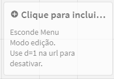
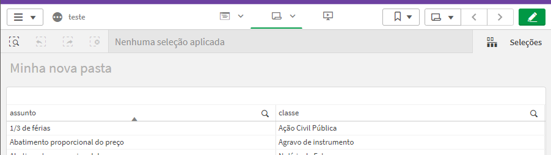
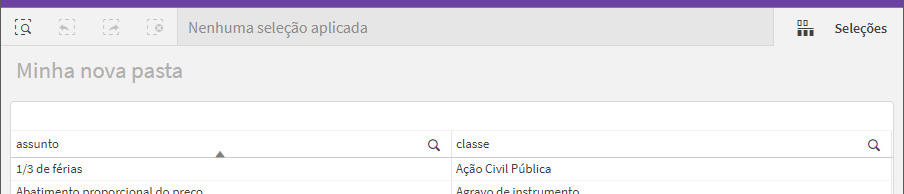

# Qlik Sense Hide Menu


This extension allows you to hide the toolbar of your Qlik Sense dashboard, giving you more space to display your data.

To use this functionality, simply add the extension to your dashboard. You can choose the smallest size to ensure it doesn't take up valuable space in your data visualization.



Before use the extension.



After use the extension.



Please note that after using this extension, the "Edit" option will no longer be available on your dashboard. To regain editing capabilities, simply add "&d=1" at the end of the panel's URL.

## Example:

```
https://sense.mpgo.mp.br/sense/app/ca632d/sheet/6de0e8da/state/analysis
```

TO

```
https://sense.mpgo.mp.br/sense/app/ca632d/sheet/6de0e8da/state/analysis?d=1
```