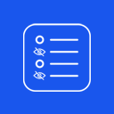

# Qlik Sense Hide Menu



Use this extension to hide the Qlik Sense dashboard toolbar.

Then you will have more space to display your data.

To use this functionality, add the extension to your dashboard. You can use the smallest size so it doesn't get in the way of your data visualization.


Before use the extension.


After use the extension.


After using this extension in your dashboard, the "Edit" option will no longer be available. So to be able to edit the panel, you must add the text " &d=1 " at the end of the panel's URL.

## Example:

```
https://sense.mpgo.mp.br/sense/app/ca632d/sheet/6de0e8da/state/analysis
```

TO

```
https://sense.mpgo.mp.br/sense/app/ca632d/sheet/6de0e8da/state/analysis?d=1
```